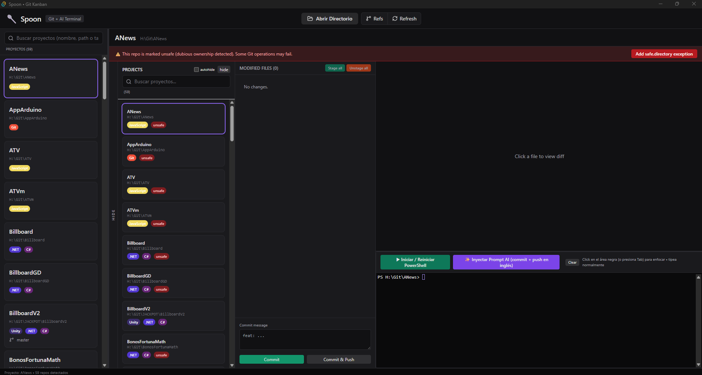

# 🥄 Spoon

**Spoon** is a fast, native desktop Git client for Windows. It brings the power and polish of advanced clients (inspired by Git Fork) together with a clean, productive layout and a **real embedded PowerShell terminal** that just works.

Scan any folder on your machine → instantly see all your Git projects with smart tech tags → manage branches, stashes, tags, remotes, files, diffs and binary previews — all without leaving the app. The PowerShell on the far right is a full `pwsh` PTY that auto-starts the latest version for the selected project.

> No Kanban. No Trello boards. Just a focused, powerful Git experience with first-class terminal integration.

## ✨ Current Features

### Project Discovery
- Open any root folder (native dialog).
- Recursive scan (ignores node_modules, target, dist, .git, etc.).
- Automatic tech tags: **Unity**, **.NET / C#**, **Python**, **Rust**, **Go**, JavaScript/TypeScript (React, Next, etc.), and easy to extend.
- Search / filter projects. Persisted last directory + filter.
- Hideable "PROJECTS" sidebar (collapses to a side tab; optional auto-hide when selecting a project).

### Refs Management (always visible column)
- **LOCAL BRANCHES**: checkout, delete (with confirm).
- **REMOTES**: list + add/edit/remove.
- **TAGS**: list, create new, delete.
- **STASHES**: list + apply / pop / drop.
- All with convenient inline action buttons. Stays visible independently of the projects column.

### Modified Files & Git Workflow
- Full list of changes (modified, added, deleted, untracked, staged status).
- Stage / unstage individual files or "Stage all" / "Unstage all".
- Discard changes or delete untracked files (with confirm).
- Quick commit box at the bottom of the files column (commit or commit & push).

### Diff + Rich Previews
- Click any file to open the diff viewer (resizable column).
- Beautiful unified diff with color highlighting for text files.
- **Native previews** for binary/media files (no more "Binary files differ"):
  - Images: PNG, JPG, JPEG, GIF, WEBP, BMP, SVG → rendered directly.
  - Video: MP4, WEBM, MOV, etc. with controls.
  - Audio: MP3, WAV, OGG, FLAC, etc. with controls.
  - PDF: embedded preview.
- Previews use Tauri's efficient `asset:` protocol (streaming, low memory).
- Stage/unstage directly from the diff panel.

### Embedded PowerShell (the killer feature)
- Full-height dedicated column on the far right.
- Real interactive `pwsh` (latest) via portable-pty + xterm.js.
- Auto-launches when you select a project (one shell per project).
- Resets banner on project switch so no accumulation.
- If `pwsh` is missing or old → the app auto-installs the latest via `winget`.
- Full input, history, colors, tab completion — it's a real terminal.
- Focus management, click-to-focus, resize-aware.

### Other Power Tools & Polish
- Unsafe / "dubious ownership" detection (common on Windows after folder moves) → shows warning + one-click **Fix** button that runs the exact `git config --global --add safe.directory <normalized/path>` command.
- Many Git actions from UI or quick terminal: fetch, pull, push, merge, rebase, cherry-pick, reset, clean, worktree, submodule, arbitrary git commands.
- Resizable columns (projects / refs / files / diff) with sizes persisted in localStorage.
- Full-height panels (proper flex + min-h-0).
- Professional top bar with icon buttons (open folder, refresh, etc.).
- Status bar, loading states, friendly Spanish/English mixed UI (easy to localize).

## 📸 Screenshot



(The layout shows projects (collapsible), refs, files, diff/preview area, and the PowerShell column on the right.)

## 🛠️ Tech Stack

- **Tauri v2** (Rust backend + webview frontend) — tiny native binary, excellent Windows integration.
- **Frontend**: React 19 + TypeScript + Vite + Tailwind + lucide-react icons + xterm.js.
- **Terminal**: portable-pty (Rust) + xterm.js for a real PTY, not a fake console.
- **Git**: thin wrappers around the real `git` CLI (fast, reliable, same behavior you expect).
- No Electron bloat. No web-only File System limitations.

## 📋 Requirements (Windows)

- Windows 10/11 (64-bit)
- PowerShell 7+ is recommended (the app will install it via winget if missing)
- Git for Windows (in PATH)
- Node.js 20+
- Rust (stable) + Cargo — easiest: `winget install Rustlang.Rustup`
- WebView2 (usually pre-installed)

## 🚀 Quick Start

```powershell
# 1. Clone
git clone https://github.com/elgodox/spoon.git
cd spoon

# 2. Install frontend dependencies
npm install

# 3. Run in development (first run will compile Rust backend + download Tauri tools)
npm run tauri dev
```

- Click **Open folder** (or the folder icon).
- Pick a directory that contains one or more Git repositories.
- Projects appear on the left. Click one.
- Use the **Refs** column (next to projects) to manage branches/stashes/tags.
- Click files to inspect diffs or see image/video previews.
- The **PowerShell** on the far right is ready — type anything (`git status`, `ls`, `code .`, etc.).

When you build a release:

```powershell
npm run tauri build
```

The installer / exe will be in `src-tauri/target/release/bundle/`.

## 💡 Usage Tips

- **Hiding projects**: Click the side tab (shows "PROJECTS" / "HIDE"). Use the checkbox for auto-hide.
- **Binary previews**: Just click a .png, .mp4, .pdf etc. in the files list. No extra config.
- **Fix unsafe repos**: If you see the red "unsafe" tag + banner, click the **Fix** button next to the project (or inline). It normalizes the path with forward slashes exactly as Git expects.
- **Terminal is real**: You can `cd`, run `npm run dev`, open editors, etc. It survives project switches (new shell per project).
- **Column sizes**: Drag the thin resizers between columns. Your layout is remembered.
- **PowerShell missing?** The app detects it and offers to install the latest pwsh using winget automatically.

## 🗺️ Roadmap Ideas (Contributions Welcome)

- Commit graph visual (the component exists but not wired in current layout)
- Better handling of renames / copies in file list
- Syntax-highlighted diffs
- GitHub integration (PRs, issues as extra info)
- Themes / customizable keybindings
- Linux + macOS support (most of the code is cross-platform; terminal spawning is the main Windows-specific part today)

## 📁 Project Structure (simplified)

```
spoon/
├── src/                  # React frontend
│   ├── App.tsx           # Main layout, state, all the columns + logic
│   ├── components/
│   │   ├── DiffViewer.tsx   # Text diff + image/video/audio/pdf previews
│   │   ├── Terminal.tsx     # xterm + PTY bridge
│   │   └── CommitGraph.tsx  # (unused in current UI)
│   └── types.ts
├── src-tauri/            # Rust + Tauri
│   ├── src/
│   │   ├── lib.rs
│   │   ├── commands.rs   # All the git + scan + terminal commands
│   │   └── terminal.rs   # PTY + pwsh launcher + winget logic
│   ├── capabilities/
│   └── tauri.conf.json
├── package.json
└── README.md
```

## 🤝 Contributing

PRs and issues are welcome. This started as a personal tool to have "Fork power + always-on pwsh + clean multi-column UI" without the old Kanban experiment.

If you add platform support (Linux/macOS PTY) or new Git features, even better.

## 📄 License

MIT

---

Made with ❤️ for developers who live in Git + terminals on Windows.

**Spoon** — because sometimes you just need to feed your commits properly.
